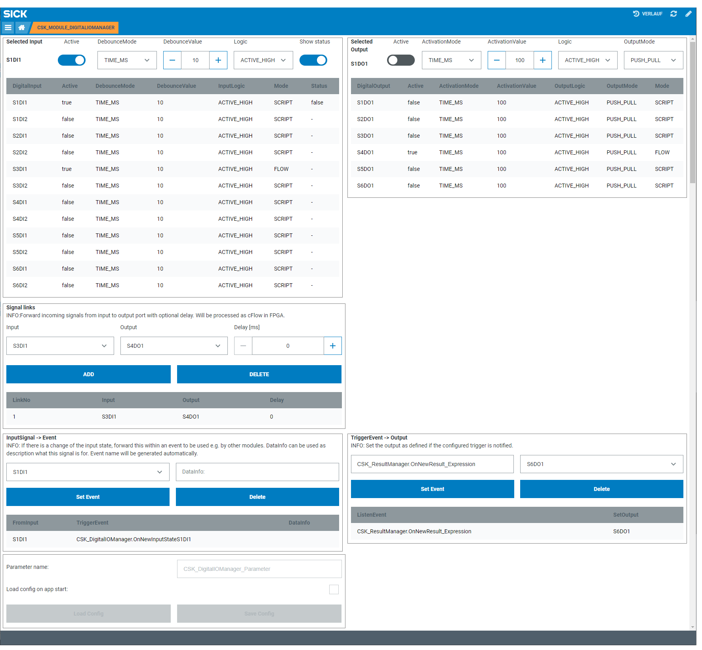

# CSK_Module_DigitalIOManager

Module to setup digital input / output connectors of the device.

## How to Run

The app includes a GUI to setup available digital input / output interfaces and optionally link digital input / output ports via an internal cFlow.  
It is also possible to setup events to listen to (e.g. listen to an event and trigger a digital output signal if notified) and other apps can register to internal events to receive 'OnChange' events.  
For further information regarding the internal used functions / events, please check out the [documentation](https://raw.githack.com/SICKAppSpaceCodingStarterKit/CSK_Module_DigitalIOManager/main/docu/CSK_Module_DigitalIOManager.html) in the folder "docu".  

## Known issues

By creating a "Signal link" (running in cFlow) an existing "true" state of the input port will directly be forwarded to the configured output port once without any delay.  
Only after that single trigger it will consider a configured delay.

## Information

Tested on  
|Device|Firmware version|Module version|
|--|--|--|
|SIM1012|v2.4.1|v3.9.0|
|SIM1012|v2.3.0|v3.9.0|
|SICK AppEngine|v1.3.2|v3.9.0|
|SICK AppEngine|v1.3.2|v3.8.1|

This module is part of the SICK AppSpace Coding Starter Kit developing approach.
It is programmed in an object-oriented way. Some of these modules use kind of "classes" in Lua to make it possible to reuse code / classes in other projects.  
In general, it is not necessary to code this way, but the architecture of this app can serve as a sample to be used especially for bigger projects and to make it easier to share code.  
Please check the [documentation](https://github.com/SICKAppSpaceCodingStarterKit/.github/blob/main/docu/SICKAppSpaceCodingStarterKit_Documentation.md) of CSK for further information.  

## Topics

Coding Starter Kit, CSK, Module, SICK-AppSpace, Digital, IO, SIM, Connector, Flow
