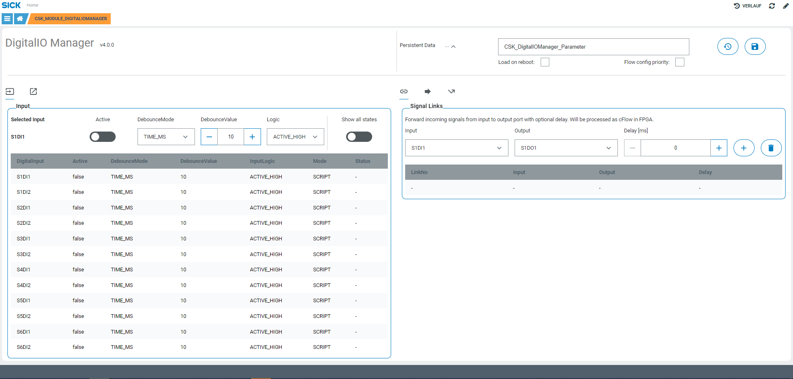

# CSK_Module_DigitalIOManager

Module to setup digital IO connectors of the device.  

## How to Run

The app includes an GUI to setup and optionally link ports via internal cFlow available IO interfaces.  
It is also possible to setup events to listen to (e.g. listen on event and trigger output if notified) and other apps can register to internal events to receive OnChange events.  
For further information regarding the internal used functions / events check out the [documentation](https://raw.githack.com/SICKAppSpaceCodingStarterKit/CSK_Module_DigitalIOManager/main/docu/CSK_Module_DigitalIOManager.html) in the folder "docu".

## Information

Tested on  
|Device|Firmware|Module version
|--|--|--|
|SIM1012|V2.3.0|V3.9.0|
|SICK AppEngine|V1.3.2|V3.8.1|

This module is part of the SICK AppSpace Coding Starter Kit developing approach.  
It is programmed in an object oriented way. Some of these modules use kind of "classes" in Lua to make it possible to reuse code / classes in other projects.  
In general it is not neccessary to code this way, but the architecture of this app can serve as a sample to be used especially for bigger projects and to make it easier to share code.  
Please check the [documentation](https://github.com/SICKAppSpaceCodingStarterKit/.github/blob/main/docu/SICKAppSpaceCodingStarterKit_Documentation.md) of CSK for further information.  

## Topics

Coding Starter Kit, Digital, IO, SIM, Connector, Module, SICK-AppSpace, Flow
